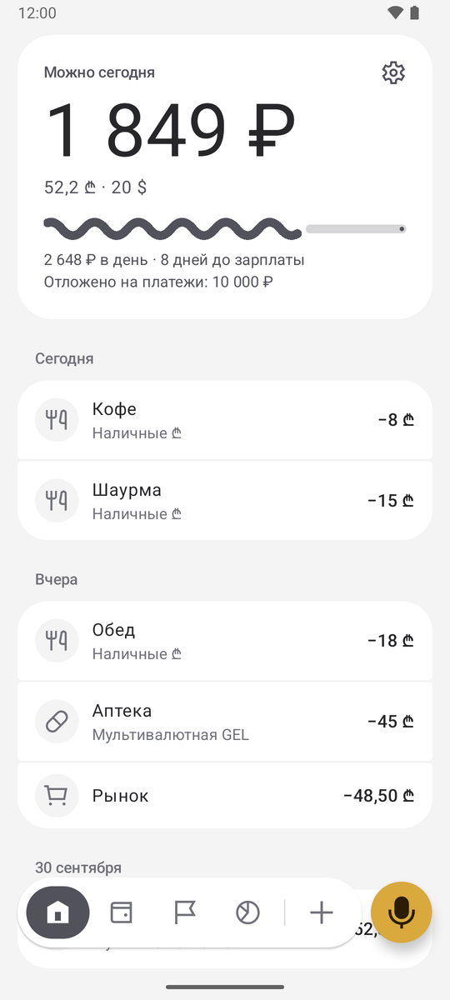
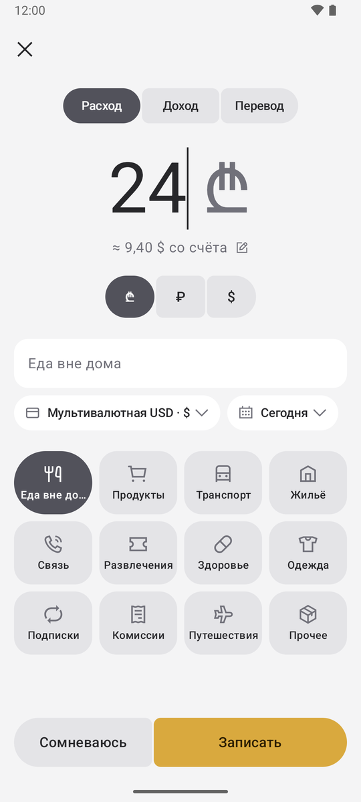
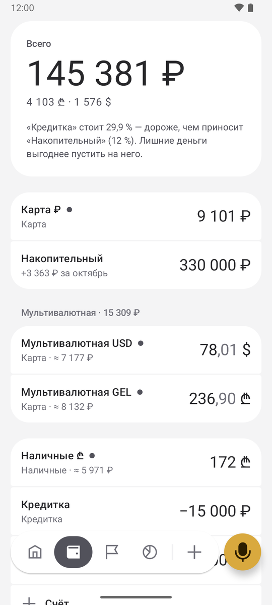
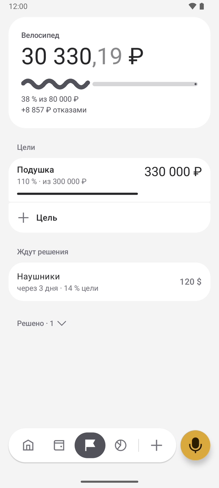
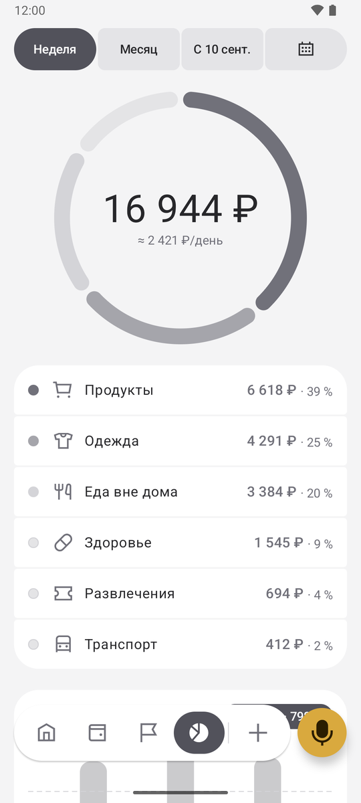
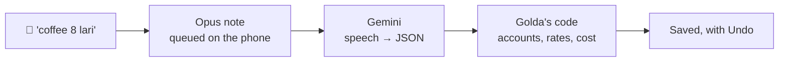

<p align="center">
  
</p>

<h1 align="center">Golda</h1>

<p align="center">
  <b>A voice-first money tracker for people who earn in one currency and live in another.</b>
</p>

<p align="center">
  <a href="https://github.com/shamil-aminov/golda/actions/workflows/ci.yml"></a>
  <a href="https://github.com/shamil-aminov/golda/releases/latest"></a>
  <a href="https://github.com/shamil-aminov/golda/releases"></a>
  <a href="#requirements"></a>
  <a href="LICENSE"></a>
</p>

<p align="center"><i>Русская версия: <a href="README.ru.md">README.ru.md</a></i></p>

<p align="center">
  
  
  
  
  
</p>
<p align="center"><sub>Demo data. Home, a new expense, accounts, goals, insights. <a href="docs/screenshots/home-dark.png">Dark theme</a>.</sub></p>

---

Golda is a personal money tracker for Android. It is for one person on one
phone. Income arrives in rubles, but you pay in lari, dollars or baht, after a
chain of transfers, card conversions and ATM withdrawals. Golda shows what each
purchase really cost you in rubles, at the rate you actually got rather than
the official one.

You record a purchase by saying it: "shawarma 15 lari". That is deliberate.
Golda never reads your bank notifications, because saying the purchase out
loud is the moment you notice you are spending.

## Features

- **Every amount in several currencies.** You pick the currencies, and every
  amount shows in all of them: `15 ₾ ≈ 530 ₽ · 5,8 $`.
- **Real cost, not the official rate.** Each account remembers what its money
  cost in rubles, and spending and transfers carry that cost along.
- **Voice entry.** Tap the mic, the home-screen widget, the Quick Settings tile
  or the app shortcut. Then say one or more purchases, an income or a transfer
  with two amounts. Notes recorded offline, or before you add an API key, wait
  in a queue.
- **Card purchases in another currency.** For "48.5 lari" paid from a dollar
  card, the charge is estimated at the CBR cross rate + 2 % and marked **≈**
  until you correct it.
- **Safe to spend today.** Your spendable money, minus the payments due before
  payday (rent, subscriptions, loan payments), split over the days left.
- **"Not sure".** Before buying, see the price as hours of work, a share of
  your main goal and days of budget. Then buy it, think about it (a wishlist
  with a 24 h, 3 day or 1 week timer), or skip it, and the money goes to your
  goal.
- **Goals**, linked to an account, plus whatever you didn't buy.
- **Debts.** Credit cards and loans have a rate, a payment day and a grace
  period. You get reminders, a payoff estimate, an early-repayment calculator
  and a hint on which debt to pay first.
- **Insights.** Spending by day and by category, the average per day, income,
  and how much currency exchange cost you against the CBR rate.
- **Reconcile** any account against the bank, with a Sunday reminder.
- **Backup** everything to one JSON file and restore from it.
- **Russian and English.** Material 3 Expressive, in a light graphite palette
  with a dark variant. Gold marks only the one action to take.

## How it works



The model only extracts what was said. Every number is computed by the app:

- **Double-entry ledger.** Every operation is a set of postings. Each posting
  holds an amount in the account's currency and its cost in rubles. The sum
  of an account's postings gives both its balance and its ruble cost basis.
- **Average cost.** Money leaves an account at the account's average ruble cost
  per unit. A transfer passes that cost on to the receiving account. Dollars
  bought at 92 ₽ and taken out of an ATM as lari make those lari cost what the
  dollars cost.
- **Display rates** are the CBR rate × (1 + markup). The markup starts at 10 %
  and is learned from your own ruble-to-currency transfers: 46 000 ₽ for 500 $
  at a CBR rate of 83.25 means +10.5 %.
- **Exchange loss** compares each currency exchange with the CBR rates of both
  currencies on the day it happened.
- Money is stored as `Long` minor units, never `Double`.

The full design, in Russian, is in [SPEC.md](SPEC.md).

## Requirements

- **Phone:** Android 16 (API 36) or newer.
- **For voice entry:** your own Google Gemini API key (see below). Everything
  else works without it.

The app is in English and Russian. It follows the system language and can be
switched in Settings.

## Getting started

1. **Download** the APK from the [latest release](../../releases/latest) and
   install it. Android will ask you to allow installs from your browser or
   file manager.
2. **Set up** income, currencies and accounts with their current balances.
   Rough numbers are fine; reconciling fixes them later.
3. **Get a Gemini API key** in
   [Google AI Studio](https://aistudio.google.com/apikey). Then open
   Settings (the gear on the Home tile) → **Gemini key** and paste it. The free
   tier is enough to try it, and with billing on, a voice note costs a tiny
   fraction of a cent.
4. **Tap the gold mic** and say what you bought.

## Privacy

- Accounts, operations, goals and settings stay in the app's private storage
  on your phone. There is no server, no account and no analytics.
- Voice notes are sent to Google's Gemini API with **your own** key, only to
  be turned into text and numbers. Google's terms for the Gemini API apply to
  that audio.
- The key is encrypted with AES-GCM under an Android Keystore key. It is sent
  in the `x-goog-api-key` header, never in a URL, and is left out of backups.
- The only other network request fetches the daily exchange rates of the Bank
  of Russia from `cbr-xml-daily.ru`.

## Building

Requirements: Android Studio, or JDK 21+ and the Android SDK. The JDK bundled
with Android Studio (`jbr`) works.

```bash
./gradlew assembleDebug
```

Release builds, signing and publishing are described in
[docs/RELEASING.md](docs/RELEASING.md). Without a key, a release build is
signed with the debug key.

## Testing

```bash
./gradlew test
```

The unit tests need no device. They cover the ledger and cost basis, rates
and card-charge estimates, the budget and its pace, savings interest, debts
and the prepayment calculator, goals, analytics, and how voice answers turn
into operations.

Debug builds can fill the app with a made-up demo, which **erases everything
in the app first**. [CONTRIBUTING.md](CONTRIBUTING.md) explains how to run it
next to a real install safely.

## Project layout

```
domain/   Money maths with no Android dependency: rates, ledger, budget,
          interest, debts, goals, the voice-answer mapper. Covered by JVM tests.
data/     Room database, DataStore settings, CBR rates, Gemini client,
          Keystore vault, backups, reminders, the demo fill.
ui/       Jetpack Compose screens, the toolbar and the palette.
tools/    coin.py, which draws the launcher icon.
```

## Contributing

See [CONTRIBUTING.md](CONTRIBUTING.md).

## License

[MIT](LICENSE). The icons are from [Iconoteka](https://iconoteka.com) (MIT,
see [third_party/iconoteka/LICENSE](third_party/iconoteka/LICENSE)), and the
colours follow Tailwind CSS's Zinc scale. Third-party components are listed in
[NOTICE](NOTICE).
