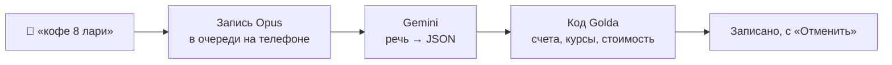

<p align="center">
  
</p>

<h1 align="center">Golda</h1>

<p align="center">
  <b>Трекер денег с голосовым вводом для тех, кто зарабатывает в одной валюте, а живёт в другой.</b>
</p>

<p align="center">
  <a href="https://github.com/shamil-aminov/golda/actions/workflows/ci.yml"></a>
  <a href="https://github.com/shamil-aminov/golda/releases/latest"></a>
  <a href="https://github.com/shamil-aminov/golda/releases"></a>
  <a href="#что-нужно"></a>
  <a href="LICENSE"></a>
</p>

<p align="center"><i>English version: <a href="README.md">README.md</a></i></p>

<p align="center">
  
  
  
  
  
</p>
<p align="center"><sub>Демо-данные. Главная, новый расход, счета, цели, аналитика. <a href="docs/screenshots/home-dark.png">Тёмная тема</a>.</sub></p>

---

Golda — личный трекер денег для Android, рассчитанный на одного человека с
одним телефоном. Доход приходит в рублях, а платите вы в лари, долларах или
батах — после цепочки переводов, конвертаций по карте и банкоматов. Golda
показывает, во сколько рублей на самом деле обошлась каждая покупка: по тому
курсу, который вам достался, а не по официальному.

Трата записывается фразой: «шаурма 15 лари». Так задумано. Уведомления банков
Golda не читает: момент, когда проговариваешь покупку вслух, и есть момент,
когда замечаешь, что тратишь.

## Возможности

- **Любая сумма сразу в нескольких валютах.** Валюты выбираете вы, и каждая
  сумма видна во всех: `15 ₾ ≈ 530 ₽ · 5,8 $`.
- **Основная валюта.** Крупные цифры и итоги можно смотреть в долларах, лари
  или любой валюте показа. Учёт остаётся в рублях; не рублёвая цифра — это
  рублёвая сумма по сегодняшнему курсу показа.
- **Реальная стоимость, а не курс ЦБ.** Каждый счёт помнит, во сколько рублей
  обошлись деньги на нём. Траты и переводы несут эту стоимость с собой.
- **Голосовой ввод.** Кнопка микрофона, виджет на домашнем экране, плитка в
  шторке или ярлык на иконке. Можно назвать несколько покупок, доход или
  перевод с двумя суммами. Записи без сети или до ввода ключа ждут в очереди.
- **Покупки в чужой валюте по карте.** Если «48,5 лари» оплачены с долларовой
  карты, списание оценивается по кросс-курсу ЦБ + 2 % и помечается **≈**, пока
  вы его не поправите.
- **Можно сегодня.** Свободные деньги минус платежи до зарплаты (аренда,
  подписки, кредиты), поделённые на оставшиеся дни.
- **«Сомневаюсь».** Перед покупкой видна цена в часах работы, доле главной
  цели и днях бюджета. Дальше «Беру», «Подумаю» (вишлист с таймером на 24 часа,
  3 дня или неделю) или «Не беру» — тогда сумма идёт в цель.
- **Цели** с привязанным счётом, куда добавляется всё, что вы не купили.
- **Долги.** У кредитки и кредита есть ставка, день платежа и льготный период.
  Приложение напоминает о платежах, считает срок и переплату, показывает
  калькулятор досрочного погашения и подсказывает, какой долг гасить первым.
- **Аналитика.** Траты по дням и категориям, средняя трата в день, доходы и
  потери на обмене против курса ЦБ.
- **Сверка** любого счёта с банком и напоминание по воскресеньям.
- **Резервная копия** всего в один JSON-файл и восстановление из него.
- **Русский и английский.** Material 3 Expressive, светлая графитовая палитра
  и тёмный вариант. Золотом отмечено только одно главное действие.

## Как это устроено



Модель только разбирает сказанное. Все числа считает приложение:

- **Двойная запись.** Каждая операция — набор проводок. В проводке две суммы:
  в валюте счёта и в рублях. Сумма проводок счёта даёт и баланс, и рублёвую
  себестоимость.
- **Средняя цена.** Деньги уходят со счёта по его средней рублёвой цене, а
  перевод передаёт эту цену счёту-получателю. Доллары, купленные по 92 ₽ и
  снятые в банкомате как лари, делают лари такими же дорогими.
- **Курс показа** = курс ЦБ × (1 + наценка). Наценка сначала 10 %, а потом
  выучивается по вашим переводам из рублей: 46 000 ₽ за 500 $ при курсе ЦБ
  83,25 — это +10,5 %.
- **Потери на обмене** — каждый обмен валют против курсов ЦБ обеих валют на
  день обмена.
- Деньги хранятся как `Long` в минимальных единицах, а не как `Double`.

Подробное описание — в [SPEC.md](SPEC.md).

## Что нужно

- **Телефон:** Android 8.0 (API 26) или новее. Голосовые заметки пишутся
  в Opus с Android 10 и в AAC на Android 8–9.
- **Для голосового ввода:** свой ключ Google Gemini API (см. ниже). Всё
  остальное работает и без него.

Приложение на русском и английском. Язык берётся из системы, его можно
сменить в настройках.

## Начало работы

1. **Скачайте** APK из [последнего релиза](../../releases/latest) и
   установите. Android попросит разрешить установку из браузера или
   файлового менеджера.
2. **Укажите** доход, валюты и счета с текущими балансами. Можно примерно —
   сверка потом поправит.
3. **Получите ключ Gemini** в [Google AI Studio](https://aistudio.google.com/apikey),
   затем откройте настройки (шестерёнка на плитке главного экрана) →
   **Ключ Gemini** и вставьте его. Для пробы хватит бесплатного уровня, а с
   включённой оплатой одна запись стоит доли цента.
4. **Нажмите золотой микрофон** и скажите, что купили.

## Приватность

- Счета, операции, цели и настройки хранятся только в памяти приложения на
  телефоне. Ни сервера, ни аккаунта, ни аналитики.
- Голосовые записи уходят в Google Gemini API с **вашим собственным** ключом,
  только чтобы превратиться в текст и числа. На этот звук распространяются
  условия Google для Gemini API.
- Ключ зашифрован AES-GCM ключом из Android Keystore. Он передаётся заголовком
  `x-goog-api-key`, никогда не в URL, и в резервную копию не попадает.
- Единственный другой сетевой запрос — ежедневные курсы Банка России с
  `cbr-xml-daily.ru`.

## Сборка

Нужны Android Studio или JDK 21+ с Android SDK. Подойдёт JDK из Android
Studio (`jbr`).

```bash
./gradlew assembleDebug
```

Релизная сборка, подпись и публикация описаны в
[docs/RELEASING.md](docs/RELEASING.md). Без ключа релиз подписывается
debug-ключом.

## Тесты

```bash
./gradlew test
```

Юнит-тестам не нужно устройство. Они покрывают двойную запись и
себестоимость, курсы и оценку списаний по карте, бюджет и его темп, проценты
по накопительному счёту, долги и калькулятор досрочки, цели, аналитику и
превращение голосового ответа в операции.

Отладочная сборка умеет заполнять приложение выдуманными данными, но сначала
**стирает в нём всё**. Как запускать это рядом с настоящей установкой без
риска, написано в [CONTRIBUTING.md](CONTRIBUTING.md).

## Устройство проекта

```
domain/   Денежная математика без зависимостей от Android: курсы, проводки,
          бюджет, проценты, долги, цели, разбор голосового ответа. Покрыта
          JVM-тестами.
data/     Room, настройки в DataStore, курсы ЦБ, клиент Gemini, хранилище
          ключа в Keystore, резервные копии, напоминания, демо-данные.
ui/       Экраны на Jetpack Compose, панель и палитра.
tools/    coin.py, который рисует иконку приложения.
```

## Участие

См. [CONTRIBUTING.md](CONTRIBUTING.md).

## Лицензия

[MIT](LICENSE). Иконки — [Iconoteka](https://iconoteka.com) (MIT, см.
[third_party/iconoteka/LICENSE](third_party/iconoteka/LICENSE)), цвета следуют
шкале Zinc из Tailwind CSS. Сторонние компоненты перечислены в
[NOTICE](NOTICE).
